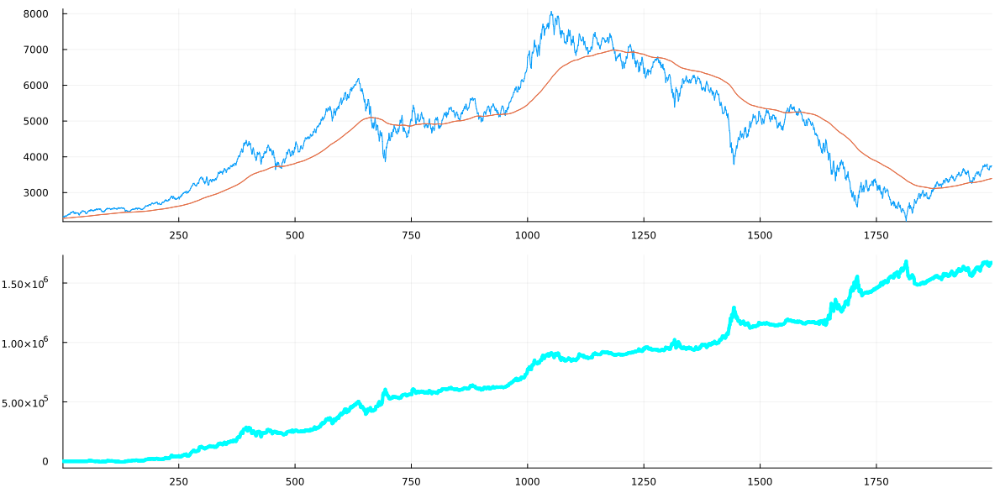
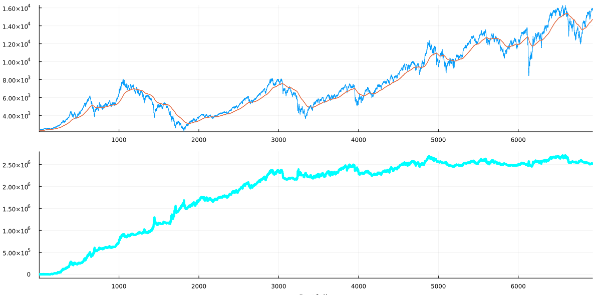

 
This is a machine learning system for constructing and validating financial trading strategies.  

## Applications

It handles trades with entries (long or short) on daily open or close, holding for no more than N (adjustable for plus/minus of a week) number of days, and exit on daily open or close.  It's been tested to work well on cryptos, ETF's, indices, commodities, and futures.  

One certainly can try it on individual stocks, but since the prices of individual stocks can be influenced by many factors and tend to change much less consistently, the results from the learning can be less reliable.

## The way it's used

To study on a financial instrument, one first needs to get the daily historical data in CSV format with the following columns: Open, Low, High, Close.  If it's a futures instrument, then the contracts need to be stitched to make a continuous contract (Stitch routines are included here, and are also published in another project called Stitcher under a different license).

Once the historical data is handy, one needs to decide and cut out a section used for training the systems.  The system performs multiple rounds of studies and validations of thousands or even hundreds of thousands of possibilities (the user can preset subsets of interesting possibilities).  At the end, it constructs strategies that can be launched for trading.  

Unlike most other machine learning practices that aim to obtain the "best" strategy only ending up losing in real trades, this system aims to construct strategies that remains valid for trades in the forseeable future.

## Demonstrations

The following demonstrations are based on trading with a capital of \$100,000.  Profits are not re-invested, and losses are not taken out.  No leverage or margins are used.  Certain commissions and slippages are specified in file `./Strategies/Contracts_CFG/Contracts_CFG.csv`.

Shorts trade in the way as in futures, i.e. one deposits a guarantee on entering a short position.  For example, to enter a short position of 100 units of an instrument at the price of \$90, one needs to pay (100 x \$90 + commission) up front, and to exit the short position at \$85, one gets back (100 x \$90 + 100 x (\$90 - \$85) - commission).

In all the charts of the following demonstrations, the horizontal axis is the number of days (starting from day 1), and the vertical axis denotes either the price (on price charts) or the profit/loss in USD starting from \$0 at day 1.

There are 5 charts in each of the following demonstrations.  The first 4 are with the training data, i.e. the in-sample data.  The constructed strategies are purely based on the learning with the training data.  The last chart shows the trading performance of a longer period outside of the training data, i.e. the out-sample results, or walk-forward results.  This last chart demonstrates how effective the training and learning is.

### [S&P 500](https://finance.yahoo.com/quote/%5EGSPC?p=%5EGSPC)

Training data:

Preliminary results:

Secondary results:

Outcome:

 
Performance of future trading (note the training section at the beginning of the data set):

### [Bitcoin](https://finance.yahoo.com/quote/BTC-USD?p=BTC-USD)

Training data:

Preliminary results:

Secondary results:

Outcome:

 
Performance of future trading (note the training section at the beginning of the data set):

### [FTSE 100](https://finance.yahoo.com/quote/%5EFTSE?p=%5EFTSE)

Training data:

Preliminary results:

Secondary results:

Outcome:

 
Performance of future trading (note the training section at the beginning of the data set):

### [DAX](https://finance.yahoo.com/quote/%5EGDAXI?p=%5EGDAXI)

Training data:

Preliminary results:

Secondary results:

Outcome:

 
Performance of future trading (note the training section at the beginning of the data set):

### [CAC 40](https://finance.yahoo.com/quote/%5EFCHI?p=%5EFCHI)

Training data:

Preliminary results:

Secondary results:

Outcome:

 
Performance of future trading (note the training section at the beginning of the data set):

### [Nikkei 225](https://finance.yahoo.com/quote/%5EN225?p=%5EN225)

Training data:

Preliminary results:

Secondary results:

Outcome:

 
Performance of future trading (note the training section at the beginning of the data set):

### [Palm Oil futures](https://www.barchart.com/futures/quotes/YH*0/profile)

Training data:

Preliminary results:

Secondary results:

Outcome:

 
Performance of future trading (note the training section near the beginning of the data set):

## How to get it

The published source codes here are samples. The system is fully functional and been at use during my algorithmic trading ventures at least for the past 7 years, as it kept being perfected, it's only intended to be used outside in serious collaborations.

## How to collaborate

If you represent a sound financial institution, or if you have been an elite trader/investor with a solid standing, and would like to propose ways of collaboration, please write me an email at [dxjia1 at gmail dot com]