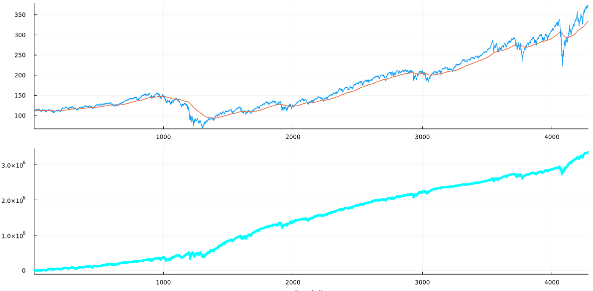
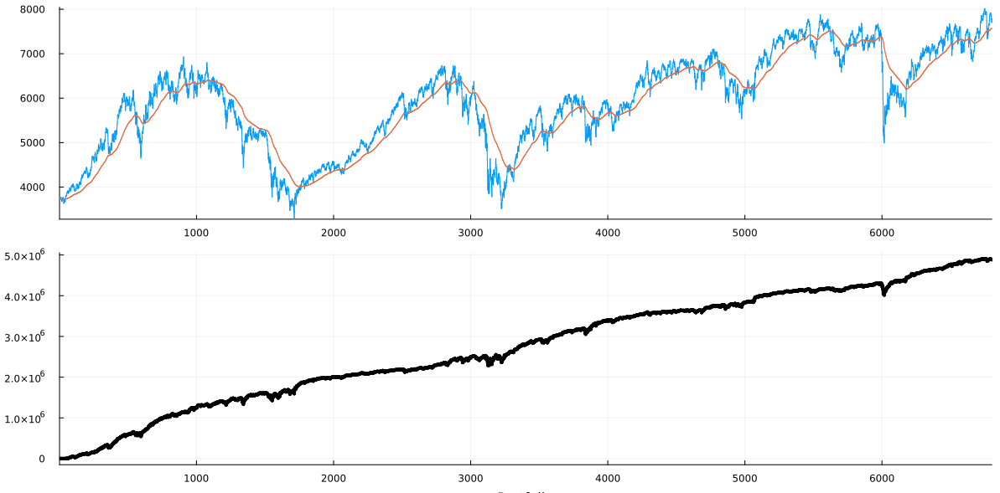
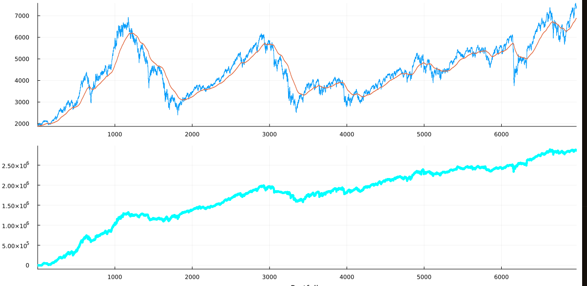

## What it is

This is a powerful machine learning system that's been developed, used and perfected in the past 10 years for constructing and validating financial trading strategies (long/short).  It uses purely proprietary specialized algorithms that 1) requires minimal system resources and training data, 2) is capable of automatic construction of sustainable trading strategies, and 3) is applicable to various instruments.

Unlike most other machine learning practices that aim to obtain the "best" strategy only ending up losing in real trades, this system aims to construct strategies that remains valid for trades in the foreseeable future.

## Applications

It handles trades with entries (long or short) on daily open or close, holding for various number of days, and exit on daily open or close.  It's been tested to work well on cryptos, ETF's, indices, commodities, and futures.

## The way it's used

To study on a financial instrument, one first needs to get the daily historical data in CSV format with the following columns: Open, Low, High, Close.  If it's a futures instrument, then the contracts need to be stitched to make a continuous contract (Stitch routines are included here, and are also published in another project called Stitcher under a different license).

Once the historical data is handy, one needs to decide and cut out a section used for training the systems.  Also specific requirements can be set so that the outputs can be more suitable to one's trading flavors.  The system performs multiple rounds of studies and validations of thousands or even hundreds of thousands of possibilities (the user can preset subsets of interesting possibilities).  At the end, it constructs strategies that can be launched for trading.

## Showcases

*** Updated: The following reflect both a minor system update and trading dates update ***

Showcases below include results with S&P 500, SPY, Bitcoin, FTSE 100, DAX, CAC 40, Nikkei 225, and Palm Oil futures.

All cases are based on trading with a capital of \$1,000,000.  Profits are not re-invested, and losses are not taken out.  No leverage or margins are used.  Reasonable commissions and slippages are applied.

Shorts trade in the way as in futures, i.e. one deposits a guarantee on entering a short position.  For example, to enter a short position of 100 units of an instrument at the price of \$90, one needs to pay (100 x \$90 + commission) up front, and to exit the short position at \$85, one gets back (100 x \$90 + 100 x (\$90 - \$85) - commission).

In all the charts of the following cases, the horizontal axis is the number of days (starting from day 1), and the vertical axis denotes either the price (on price charts) or the profit/loss in USD starting from \$0 at day 1.

There are 5 or 8 charts in each of the following cases.  The first 4 are with the training data, i.e. the in-sample data.  The constructed strategies are purely based on the learning with the training data.  The 5th chart shows the trading performance of a longer period outside of the training data, i.e. the out-sample results, or walk-forward results.  This 5th chart demonstrates how effective the training and learning is.  If we call the strategies constructed shown on Charts 4-5 are "timid" versions, charts 6-8 on some cases are showing a "turbo" version of the strategies.  Charts 6 and 7 correspond to Charts 4 and 5.  Chart 8 shows the performance with profits reinvested and losses deducted, so as to better compare with a buy-and-hold strategy in the long term.

Note that here the purpose is not to show the best performing strategies the system can find, but to demonstrate trading performance sustainabilities of the constructed strategies in the forseeable future after the training period.  Optimal or customized strategies can be constructed by the system based on specific requirements set by the user.

### [S&P 500](https://finance.yahoo.com/quote/%5EGSPC?p=%5EGSPC)

Training data (2000-01-03 through 2009-02-23):

Outcome:

Performance of entire dataset (2000-01-03 through 2023-05-08. Note the training section at the beginning of the data set):

Performance of entire dataset with profits reinvested and losses deducted:

### [SPY](https://finance.yahoo.com/quote/SPY?p=SPY&.tsrc=fin-srch)

Constructed based on special request: train in a more recent period and show performance of last two years.

Training period is 2004-01-01 through 2020-12-31:

(Refined turbo version) Outcome for the training period:

(Refined turbo version) Performance on entire dataset (2004-01-01 through 2023-01-31):

### [Bitcoin](https://finance.yahoo.com/quote/BTC-USD?p=BTC-USD)

Training data (2017-06-01 through 2018-09-30):

Outcome:

 
Performance of entire dataset (2017-06-01 through 2023-05-08. Note the training section at the beginning of the data set):

### [FTSE 100](https://finance.yahoo.com/quote/%5EFTSE?p=%5EFTSE)

Training data (1996-06-03 through 2003-07-31):

Outcome:

 
Performance of entire dataset (1996-06-03 through 2023-05-08. Note the training section at the beginning of the data set):

### [DAX](https://finance.yahoo.com/quote/%5EGDAXI?p=%5EGDAXI)

Training data (1996-01-02 through 2003-11-28):

Outcome:

 
Performance of entire dataset (1996-01-02 through 2023-05-08. Note the training section at the beginning of the data set):

### [CAC 40](https://finance.yahoo.com/quote/%5EFCHI?p=%5EFCHI)

Training data (1996-01-02 through 2002-12-31):

Outcome:

 
Performance of entire dataset (1996-01-02 through 2023-05-08. Note the training section at the beginning of the data set):

### [Nikkei 225](https://finance.yahoo.com/quote/%5EN225?p=%5EN225)

Training data (1998-07-01 through 2006-08-11):

Outcome:

 
Performance of entire dataset (1998-07-01 through 2023-05-08. Note the training section at the beginning of the data set):

### [Palm Oil futures](https://www.barchart.com/futures/quotes/YH*0/profile)

Training data (2008-11-03 through 2014-12-31):

Outcome:

 
Performance of entire dataset (2007-12-29 through 2021-12-31. Note the training section near the beginning of the data set):

## How to get it

The published source codes here are samples. The system is fully functional and been at use during my algorithmic trading ventures at least for the past 7 years, as it kept being perfected, it's only intended to be used outside in serious collaborations.

## How to collaborate

If you represent a sound financial institution, or if you have been an elite trader/investor with a solid standing, and would like to propose ways of collaboration, please write me an email at [dxjia1 at gmail dot com]
